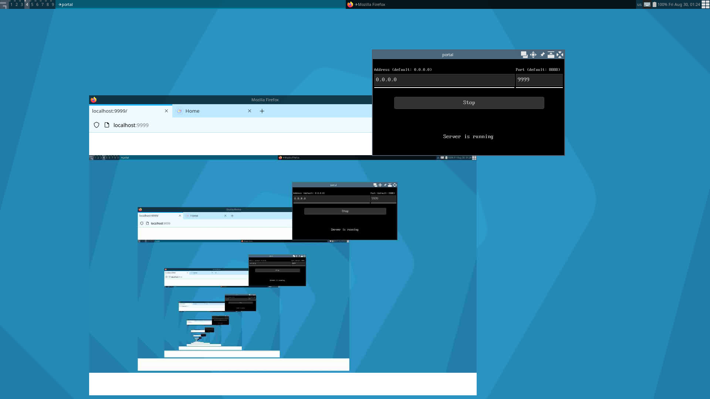

# portal

Share your screen (without sound) on local network, using (modern) browsers as viewer.

This program aims to provide all major desktop platforms (Windows, MacOS, Linux) with a simple
solution to share your screen with others on the local network, with as lowest latency as possible.

Currently only platforms listed below are supported.

- Linux
  - X11
  - FBDEV (linux framebuffer)
- Windows
  - GDI

The screenshot API (libportal) can be used as a library, see below.


## Usage

1. Run `portal` with a cmd, terminal, or directly open the GUI version on computer A.
2. Open browser and navigate to `http://{A's ip}:{port}` (port defaults to 8888) on computer B connecting to the same network of A.
3. Now content on computer A should appear on computer B.

Details of CLI options:

```
Usage: portal [options]
share your desktop on local network with ease

    -h, --help            show this help message and exit
    -l, --list-platforms  list available [platforms] list and exit

global options
    -a, --address=<str>   listen on [host = 0.0.0.0] for serving frontend
    -p, --port=<int>      listen on [port = 8888]
    --platform=<str>      which [platform = (first available)] to use

x11 platform options
    --xdisplay=<str>      connect to [display]
    --xwid=<int>          target window with [id]

fbdev platform options
    --fbdev=<str>         read pixels from [filepath]
```


## Build

A c compiler supporting C99 standard is required for building portal.

While using another build system rather than CMAKE, set environment variables (listed below) to change compiling options.

- `HOSTCC`
  - C compiler to build tools, currently `tool/bin2c.c`, defaults to `cc`.
- `CC`
  - C compiler to generate final binaries, defaults to `$HOSTCC`.
- `CFLAGS`, `LDFLAGS`
  - Flags passed to c compiler
- `OUT`
  - Final binary file name, defaults to `portal`.
- `PLATFORM_{}`
  - Whether platform `{}` is supported during runtime, `on` to enable, otherwise disable.

Examples below assume that output directory is `./build` under project root.
You can change it to whatever you like, make sure cd into it before compiling.

### Using CMAKE

Supported platforms: Linux, Windows.

```bash
mkdir build
cd build

cmake ..
make
```

### Using posix shell under Unix-like

Supported platforms: Linux, Cygwin.

```bash
mkdir build
cd build

../compile.sh
```

### Using cmd under Windows

Supported platform: Windows.

```bat
mkdir build
cd build

..\compile_win
```

To set environment variables, do something like this:

```bat
setlocal
set CC=gcc && ..\compile_win
endlocal
```


## Library

The screen capturing API (libportal under `src/libportal`) can be used as a single-header library.
You can directly embed `libportal.h` into your project.

Docs for libportal are in the header file itself.


# Screenshots




# License

MIT

